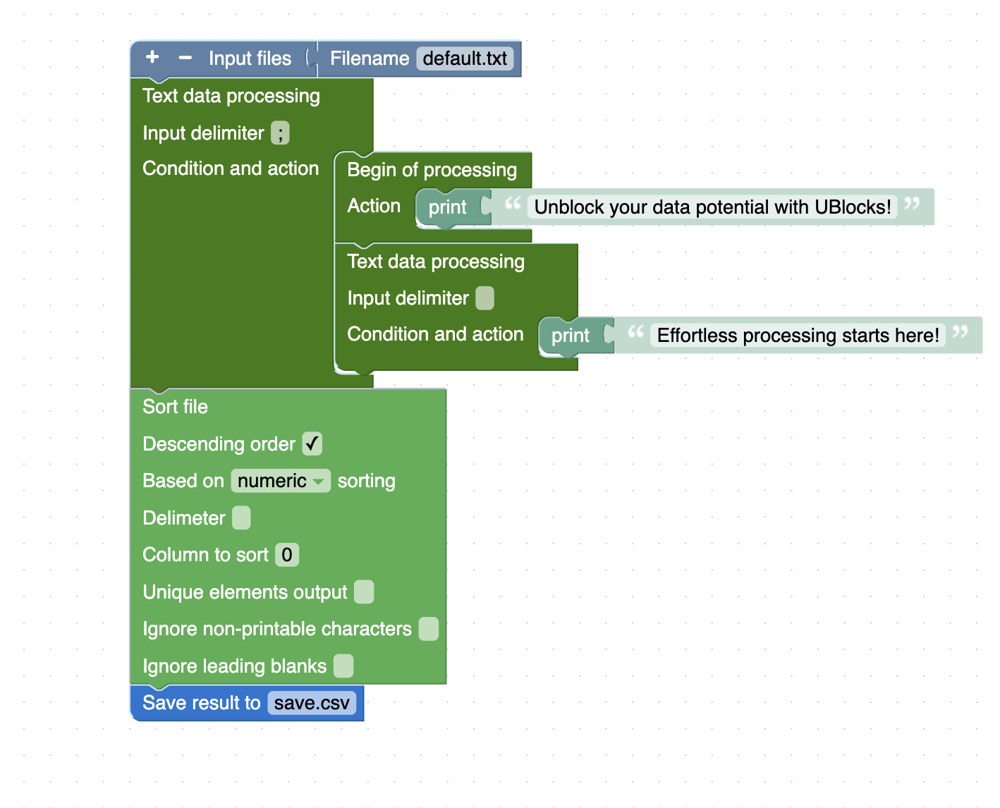

# Visual development of data processing pipelines using Blockly

This is a development environment based on the
[Blockly](https://developers.google.com/blockly) visual programming editor
where users can easily construct data processing pipelines
by plugging together processing blocks with their mouse.
The constructed pipelines are implemented using Unix tools.


# Set up instructions

To run UBlocks on a local server, navigate to the top-level directory and start the development server by running the following command:

`npm run devStart`

## Setting Up Pre-commit Hook

To ensure that code is properly formatted before committing, set up the pre-commit hook by following these steps :

1. Run the following command at the top-level directory :

   `printf '#!/bin/sh\nbin/pre-commit\n' > .git/hooks/pre-commit`

2. Make both scripts executable through the following command :

   `chmod +x .git/hooks/pre-commit bin/pre-commit`

# How to Create a New Block

Below are the instructions on how to create a new block in a separate file (e.g., `[blockName]Block.js`), and how to integrate it into the existing code generation system (`UnixGenerator`) that we have already implemented.

## 1. Create a New File for Your Block

Inside the folder where you keep your blocks (`blocks/`), create a new file named `[blockName]Block.js`.
For instance, if you want to create a block for a command called `foo`, you can name it `fooBlock.js`.

## 2. Define the Block Using a JSON Schema

In this new file, define your block using the JSON schema required by Blockly. Below is a basic structure:

```js
var fooBlock = {
  type: 'foo', // Unique name for the block
  category: 'My Custom Category', // Category in which the block will appear in the toolbox
  unix_description: [
    // The "unix_description" array defines how totranslate the block into a Unix command.
    {
      foo: 'customFoo',
      printName: true, // "printName" specifies whether the block's type should appear explicitly in the generated command.
      //  Static Handling
      myStaticField: '-s',
      myDynamicField: (fieldValues) => {
        // Example: Append the field value with a prefix
        return `--option=${fieldValues['myDynamicField']}`;
      }
    }
  ],
  message0: 'Message displayed on the block %1',
  args0: [
    {
      type: 'field_input',
      name: 'myStaticField',
      text: 'default value'
    }
  ],
  message1: 'Message displayed on the block %1',
  args1: [
    {
      type: 'field_input',
      name: 'myDynamicField',
      text: 'default value'
    }
  ],
  // Configuration for block connections (input, output, statement, etc.)
  previousStatement: 'Action',
  nextStatement: 'Action',
  style: 'My Custom Category',
  tooltip: 'Description of what this block does',
  helpUrl: '' // Optional: link to further documentation
};

// Register the block with Blockly
Blockly.defineBlocksWithJsonArray([fooBlock]);

// Register the generator handler for this block
window.unixGenerator.forBlock['foo'] = window.unixGenerator.forBlock.generic;
```

### 2.1 Managing `unix_description`

In the **UnixGenerator** architecture, each **Blockly** block has an associated `unix_description`, which describes how its fields (`fieldValues`) and child blocks (`childCode`) should be translated into a Unix command. Also it is crucial that the keys used in unix_description correspond exactly to the names of the fields defined in args. This ensures that the generator can correctly map field values to their respective parts in the Unix command. Below is a high-level overview of how this works:

#### 2.1.1 **`unix_description` Structure**

- Typically, `unix_description` is an array of one or more objects. Each object specifies functions and/or flags that define how to compose the final command.
- Example:
  ```js
  unix_description: [
    {
      printName: true, // Determines if the block's type should be printed in the command
      someFieldName: '-f', // Static string to be added if the field is active
      // Function to dynamically process fieldValues and childCode
      someInputStatementName: (fieldValues, childCode) => {
        // process fieldValues and childCode
        return `-x ${childCode}`;
      }
    }
  ];
  ```

#### 2.1.2 **Using Functions vs. Static Strings**

- **Functions**: If you need to dynamically combine or manipulate `fieldValues` and `childCode`, you can define a function in `unix_description`:
  ```js
  someFieldName: (fieldValues, childCode) => {
    return `-o ${fieldValues['someParam']} ${childCode}`;
  };
  ```
  This function will be called by the generator, and whatever string it returns will be appended to the command.
- **Static Strings**: If you only need a fixed flag (e.g., `-r`, `--verbose`), you can simply specify a string:
  ```js
  someFieldName: '-r';
  ```
  The generator will automatically add `-r` when the corresponding field is “checked” or “selected,” depending on your field definition.

#### 2.1.3 **Choosing `generic` vs. `concat` Block Handlers**

- In your main generator setup, you decide how each block’s code is combined with subsequent blocks. You can choose:
  ```js
  window.unixGenerator.forBlock['foo'] = window.unixGenerator.forBlock.generic;
  ```
  or
  ```js
  window.unixGenerator.forBlock['foo'] = window.unixGenerator.forBlock.concat;
  ```
- **`generic`**: This handler typically adds a pipe symbol (`|`) between commands, following the standard Unix “piping” convention.
- **`concat`**: This handler concatenates the output without a pipe or spaces, or uses a different connector if defined. It’s useful for scenarios where multiple arguments are strung together (e.g., building up a filename or a single argument line).

#### 2.1.4 Customizing Output with Block Names

**Specifying the Block's Name in `unix_description`:**
You can override the default block name in the generated command by specifying a different key in `unix_description`. For example:

```js
unix_description: [
  {
    foo: 'customFoo', // Instead of printing 'foo', it will print 'customFoo' in the command
    printName: true
  }
];
```

In this case, if the block's type is 'foo' and you set 'foo': 'customFoo' in unix_description, the generated command will include 'customFoo' instead of 'foo'. 3. Format the code by running the following command:

`npm run prettier-fix`

# Further information

The work behind this project is further documented in MSc theses by
[Klenti Cipi](http://www.pyxida.aueb.gr/index.php?op=view_object&object_id=11051) and
[Pantelis Kakavas](http://www.pyxida.aueb.gr/index.php?op=view_object&object_id=11053).
